# 🎓 DDU College Management System

A web-based **College Management System** developed using **Flask** and **MySQL** to simplify and manage academic and administrative activities for **DDU College of Engineering, Gorakhpur**.

The project provides separate modules for **Administrators, Teachers, and Students**, allowing academic information and day-to-day college activities to be managed through a centralized web application.

## 🏛️ Institution

**DDU College of Engineering, Gorakhpur**

**Associated University:** Deen Dayal Upadhyaya Gorakhpur University (DDUGU), Gorakhpur, Uttar Pradesh

🌐 **Official University Website:** https://www.ddugu.ac.in/

Deen Dayal Upadhyaya Gorakhpur University is located in Civil Lines, Gorakhpur, Uttar Pradesh. The university was established in 1957 and currently offers undergraduate, postgraduate and other academic programmes.

---

## 📖 Overview

The DDU College Management System is designed to manage:

- Students
- Teachers
- Attendance
- Internal Marks
- Subject Notes
- Notices
- Student and Teacher information
- Academic activities

The system reduces manual work, improves accessibility of academic information, and provides dedicated modules for different users.

---

## ✨ Features

### 👨‍🎓 Student Module

- Student Registration
- Student Login
- Forgot Password
- View Attendance
- View Internal Marks
- View Subject Notes
- Student ID Card
- View Notices

### 👨‍🏫 Teacher Module

- Teacher Registration
- Teacher Login
- Forgot Password
- Take Attendance
- Update Attendance
- Enter Internal Marks
- Upload Subject Notes
- Teacher ID Card
- Manage Academic Information

### 🏢 Admin Module

- Admin Login
- Add Students
- Update Students
- Delete Students
- View Students
- Add Teachers
- Update Teachers
- Delete Teachers
- View Teachers
- Add Notices
- Update Notices
- Delete Notices
- Manage Academic Data

---

## 🛠️ Technologies Used

- **Python**
- **Flask**
- **MySQL**
- **HTML5**
- **CSS3**
- **Bootstrap**
- **JavaScript**

---

## 📂 Project Structure

```text
CMS/
│
├── static/
│   └── images/
│
├── templates/
│   ├── student_login.html
│   ├── teacher_login.html
│   ├── institute_login.html
│   └── ...
│
├── screenshots/
│   ├── home_page.png
│   ├── admin_login.png
│   ├── admin_dashboard.png
│   └── ...
│
├── app.py
├── README.md
└── .gitignore
```

---

## 🚀 Installation

### 1. Clone the repository

```bash
git clone https://github.com/ajimullahansari/College-management-System.git
```

### 2. Navigate to the project directory

```bash
cd College-management-System
```

### 3. Install required dependencies

```bash
pip install -r requirements.txt
```

### 4. Configure MySQL

Create the required MySQL database and configure the database connection in the application.

### 5. Run the application

```bash
python app.py
```

The application will then be available through the local Flask development server.

---

## 🔮 Future Scope

Planned improvements may include:

- 🤖 AI Chatbot Integration
- 💳 Online Fee Payment System
- 📱 Mobile Application
- 📧 Email Notifications
- 📊 Student Performance Analytics
- 📈 Advanced Academic Reports
- 🔐 Improved Authentication and Security
- ☁️ Cloud Deployment

---

## 👥 Team

### Team Future Builders

- **Ajimullah Ansari** — Technical Lead
- **Sufiyan Ansari** — Presentation Lead

---

## 📸 Project Screenshots

### 🏠 Home Page

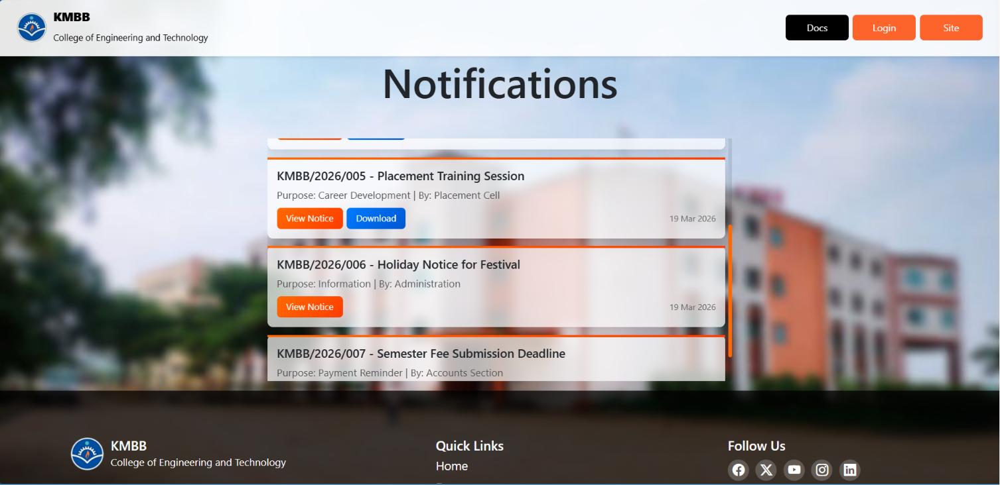

### 🔐 Admin Login

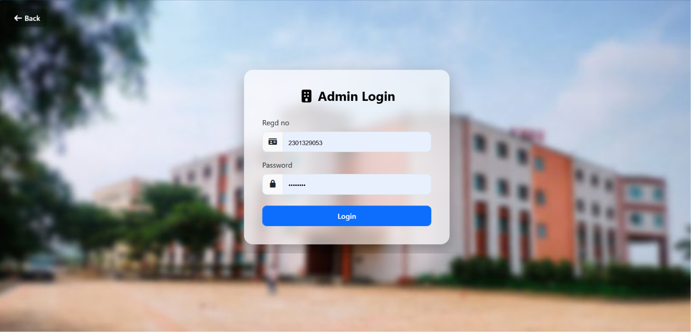

### 📊 Admin Dashboard

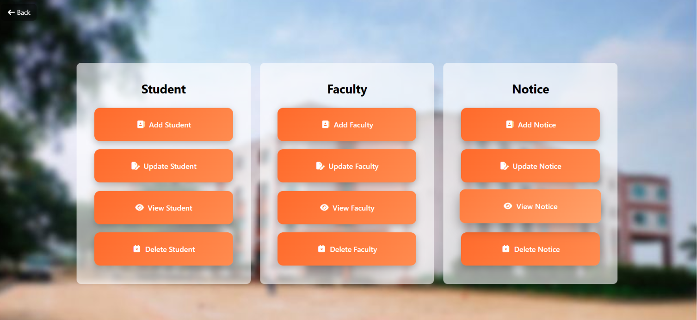

### 👨‍🏫 Faculty Login

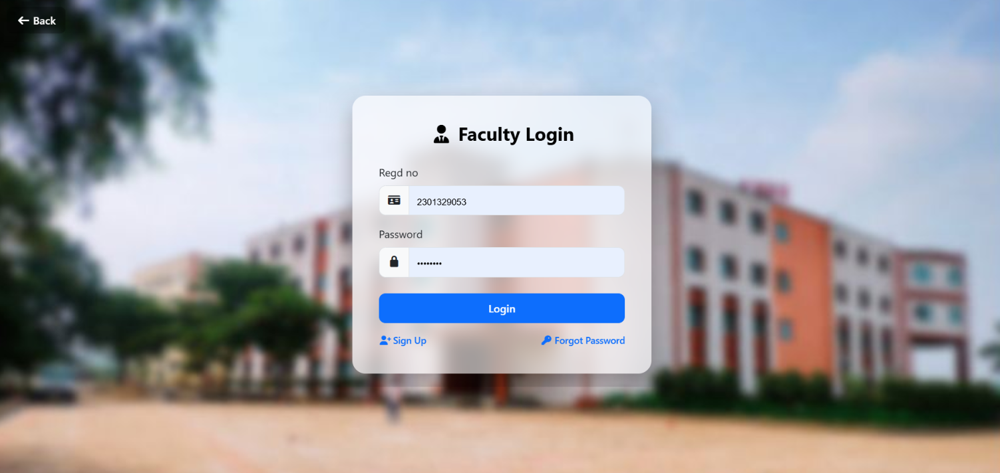

### 👨‍🏫 Faculty Dashboard

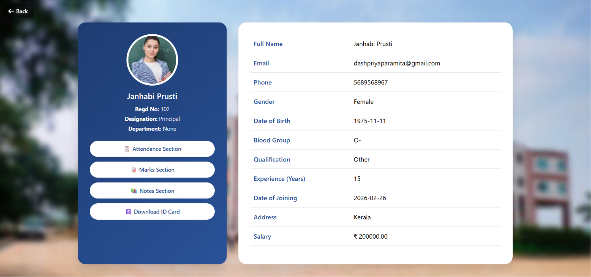

### 🎓 Student Login

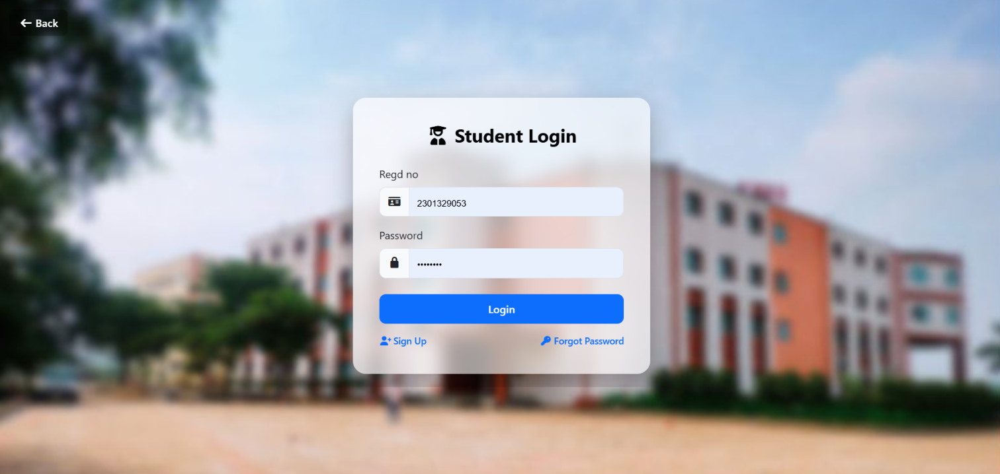

### 🎓 Student Dashboard

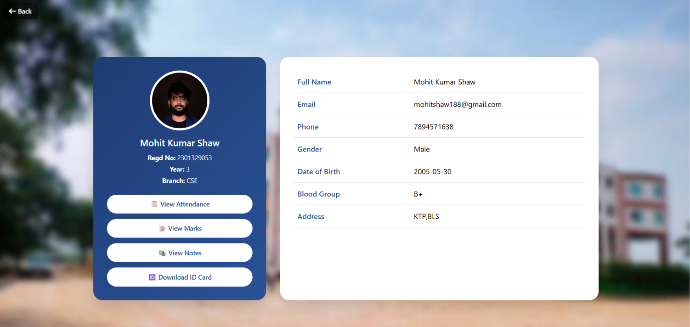

### 🪪 Student ID Card

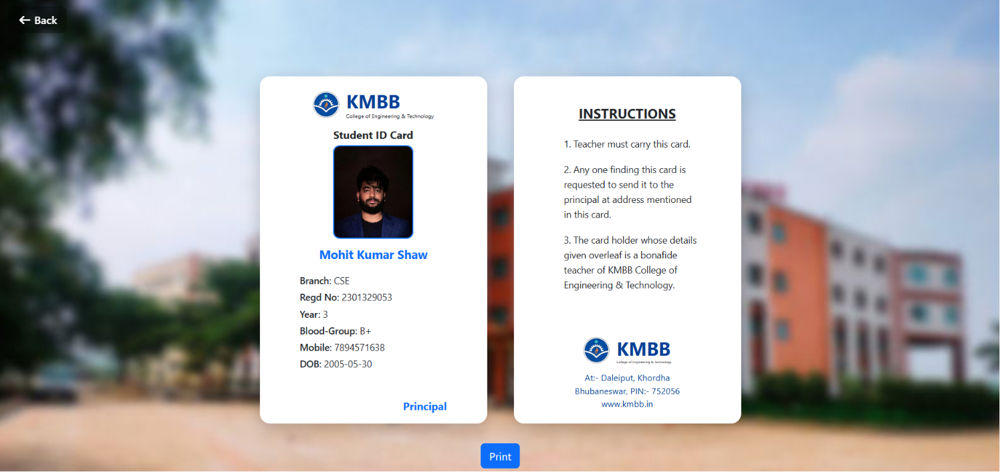

### 📅 Attendance Management

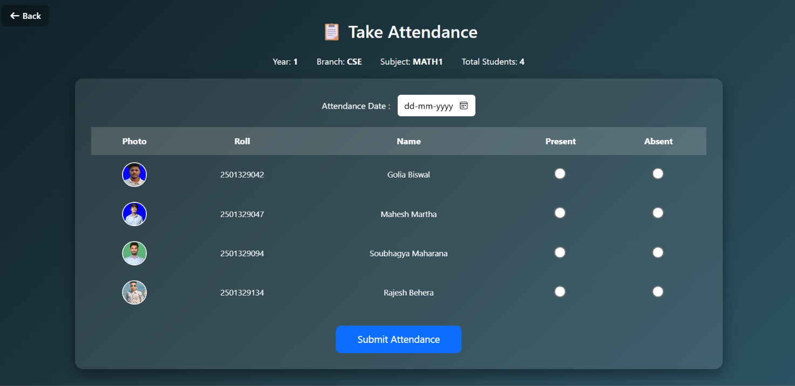

### 📝 Mark Sheet

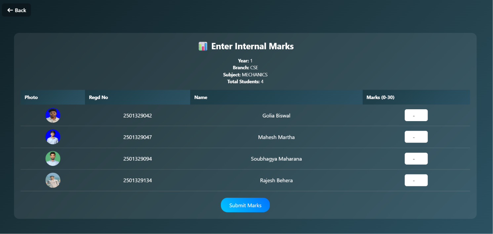

### 📢 Notice Board

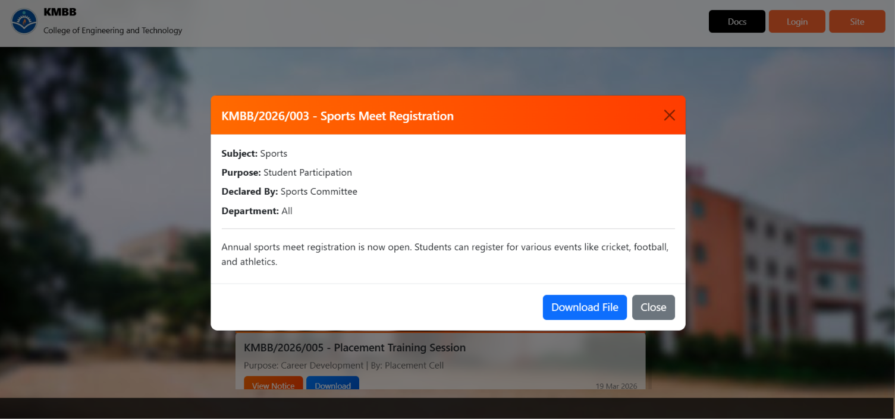

---

## 🏫 University Information

**Deen Dayal Upadhyaya Gorakhpur University (DDUGU)**
Civil Lines, Gorakhpur – 273009, Uttar Pradesh, India

🌐 **Official Website:** https://www.ddugu.ac.in/

The official university website provides information about academics, admissions, examinations, student services, affiliated colleges, notices and other university activities.

---

## 📜 License

This project is developed for **educational and academic purposes**.

© Team Future Builders
